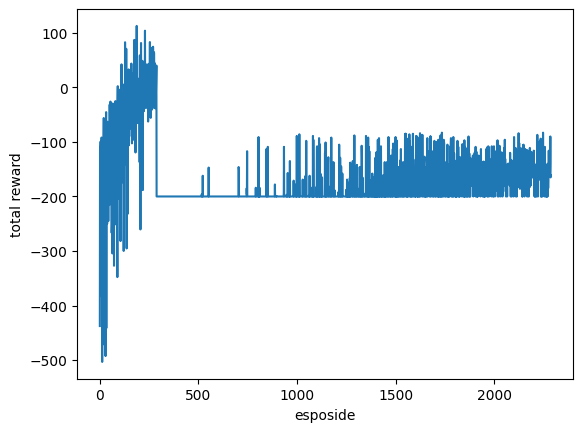
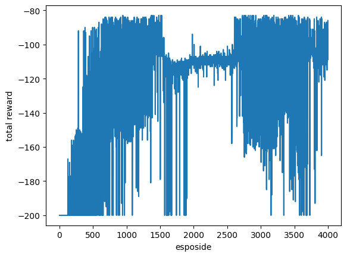

## GYM Mountain car problem

This project i have practised Gym **MountainCar-v0** using Reinforcement learning (Deep Q network with some refinements)

## Packages used
this code work for colab ,due to linux based i used packages xvfb , swing , gym[box2d] ,pyvirtualdisplay 
## Problem :
the problem which code try to solve is trying to  make car reach goal using least steps possible in 2d environment ,this by making each step has negative reward and so shortest way /correct direction is by making sum rewards least

## environment exploration
- at first i did some environment exploration to get more familiar with it by make random actions and see results ,actually calculate next state and compare with gym step 

## Algorithms and refinements:
- I have used deep Q network as environment here is continuous with descrete event ,action and non stocastic environment
- using seperate Q network ,target network to make it more better to learn
- using batches and trying on NUM_STEPS_FOR_UPDATE time to help make it faster
- using epsilon greddy and soft updates for better results

then at training i used plot line to see results and finally made video

## Esposides results:
### 2000 esposide:
Plot:

video:
[![see video]](videos/lunar_lander_2000esposide.mp4)

### 4000 esposide:
Plot:

video:
[![see video]](videos/lunar_lander_4000esposide.mp4)

#### thanks to deeplearning.ai amazing channel